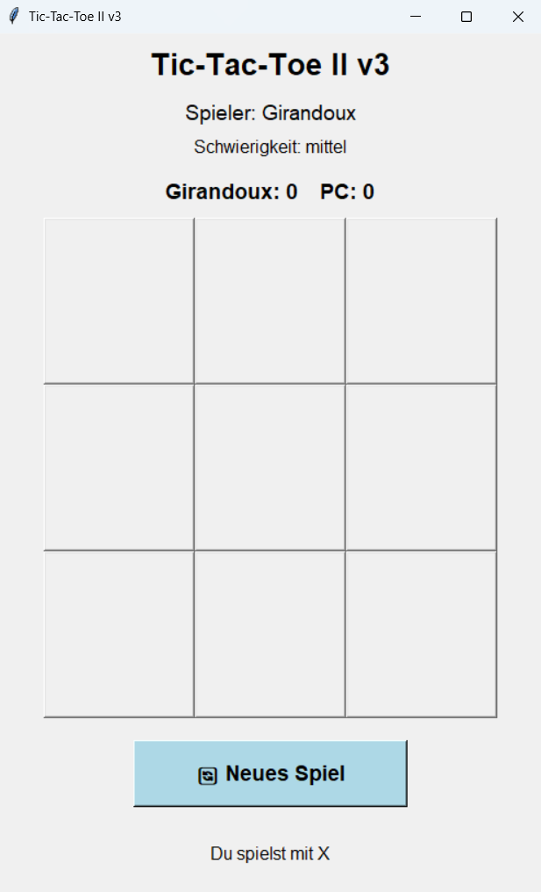
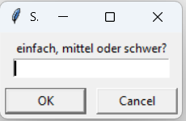
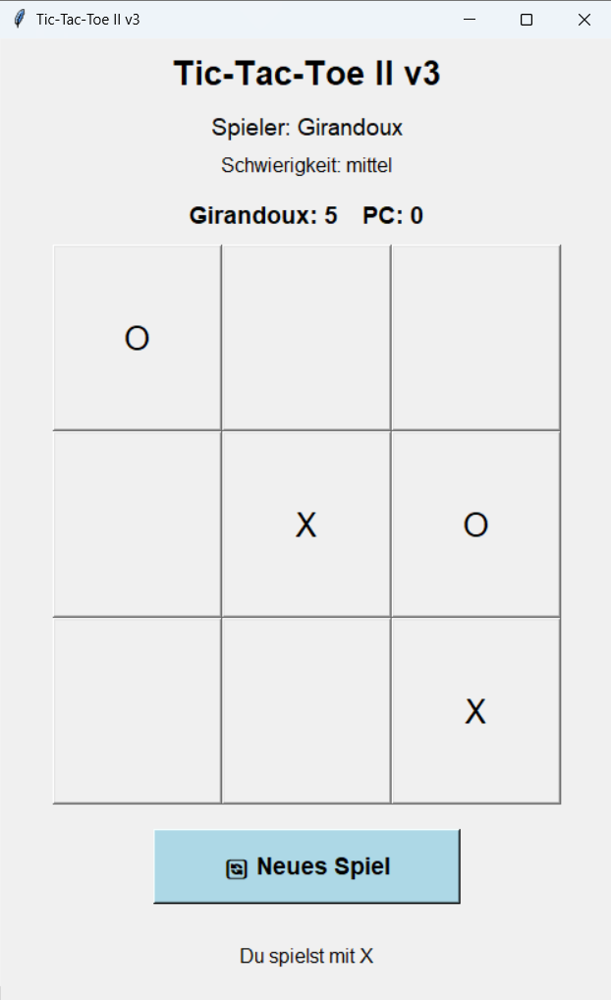
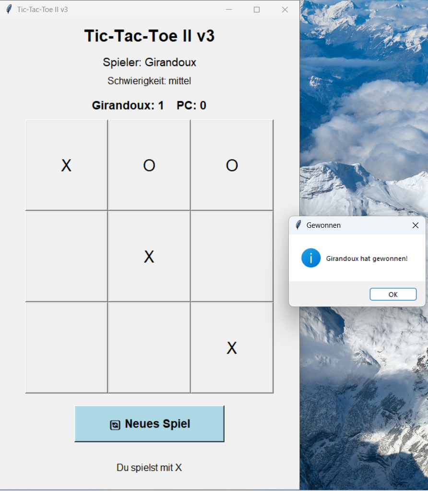

# Tic-Tac-Toe II v3

## Überblick

Tic-Tac-Toe II v3 ist eine moderne Desktop-Version des klassischen Tic-Tac-Toe-Spiels, entwickelt mit Python und Tkinter.

Das Projekt wurde erstellt, um Kenntnisse in den Bereichen GUI-Programmierung, objektorientierte Programmierung (OOP), modulare Softwareentwicklung sowie grundlegende Konzepte der künstlichen Intelligenz (KI) praktisch anzuwenden.

Der Spieler tritt in einer interaktiven grafischen Benutzeroberfläche gegen einen Computergegner mit verschiedenen Schwierigkeitsgraden an.

---

# Projekt-Highlights

- Moderne grafische Benutzeroberfläche mit Tkinter
- Spieler gegen Computer
- Drei KI-Schwierigkeitsgrade
- Punktestand-System
- Restart-Funktion
- Spielername im Fenster
- Modulare Projektstruktur
- Sauber kommentierter Code
- Objektorientierte Programmierung
- Strategische KI-Logik

---

# Funktionen

## GUI-Fenster
Das Spiel verwendet eine grafische Benutzeroberfläche (GUI) mit Tkinter anstelle der Konsole.

## Punktestand
Der Punktestand zwischen Spieler und Computer wird live aktualisiert.

## Schwierigkeitsgrade

### Einfach
Der Computer wählt zufällige Züge.

### Mittel
Der Computer blockiert mögliche Gewinnzüge des Spielers.

### Schwer
Der Computer versucht strategisch zu gewinnen und blockiert zusätzlich den Spieler.

## Restart-Button
Das Spiel kann jederzeit vollständig zurückgesetzt werden.

---

# Verwendete Technologien

- Python 3
- Tkinter
- Objektorientierte Programmierung (OOP)
- Modulare Programmierung
- Eventgesteuerte GUI-Programmierung
- Grundlegende KI-Logik

---

# Software-Architektur

Das Projekt wurde modular aufgebaut, um Wartbarkeit, Übersichtlichkeit und Wiederverwendbarkeit zu verbessern.

| Datei | Aufgabe |
|---|---|
| main_v3.py | Startet das Programm |
| window_v3.py | GUI und Benutzerinteraktion |
| myboard_v3.py | Spielfeldlogik und Gewinnbedingungen |
| KI_v3.py | KI-Verhalten und Schwierigkeitsgrade |

---

# Projektstruktur

```text
tic-tac-toe/
│
├── screenshots/
│   ├── Hauptfenster_Spiels.png
│   ├── Schwierigkeitsgrad_Fenster.png
│   ├── Spiel_gewonnen.png
│   ├── main-window.png
│   └── Spiel_während_Spielens.png
│
├── .gitignore
├── README.md
├── KI_v3.py
├── main_v3.py
├── myboard_v3.py
├── window_v3.py
├── LICENSE.txt
└── requirements.txt
```

---

# Screenshots

## Hauptfenster des Spiels



---

## Auswahl des Schwierigkeitsgrades



---

## Spiel während des Spielens



---

## Gewinnfenster



---

# Voraussetzungen

Für dieses Projekt wird benötigt:

- Python 3.x

Tkinter ist standardmäßig in Python enthalten.

---

# Installation

## Repository klonen

```bash
git clone https://github.com/Girandoux/tic-tac-toe.git
```

---

## Projektordner öffnen

```bash
cd tic-tac-toe
```

---

## Virtuelle Umgebung erstellen (optional)

### Windows

```bash
python -m venv .venv
```

---

## Virtuelle Umgebung aktivieren

### Windows

```bash
.venv\Scripts\activate
```

### Linux / Mac

```bash
source .venv/bin/activate
```

---

# Spiel starten

```bash
python main_v3.py
```

---

# Lernziele des Projekts

Dieses Projekt wurde entwickelt, um praktische Kenntnisse in folgenden Bereichen zu verbessern:

- Python-Grundlagen
- GUI-Entwicklung mit Tkinter
- Objektorientierte Programmierung
- Modulare Softwareentwicklung
- Eventgesteuerte Programmierung
- Spielentwicklung
- Grundlegende KI-Implementierung
- GitHub-Projektstruktur

---

# Warum dieses Projekt wichtig ist

Dieses Projekt demonstriert die Fähigkeit:

- vollständige Desktop-Anwendungen zu entwickeln
- saubere und modulare Softwarestrukturen zu erstellen
- grafische Benutzeroberflächen zu entwickeln
- Spiel- und KI-Logik zu implementieren
- wartbaren und strukturierten Python-Code zu schreiben

Darüber hinaus zeigt das Projekt praktische Softwareentwicklungs-Konzepte, die auch in realen Anwendungen verwendet werden.

---

# Mögliche zukünftige Erweiterungen

- Minimax-KI
- Soundeffekte
- Online-Multiplayer
- Highscore-System
- Verbesserte Benutzeroberfläche

---

# GitHub Topics

```text
python
tkinter
gui
tic-tac-toe
python-game
oop
desktop-application
artificial-intelligence
```

---

# Autor

Girandoux Fandio

---

# Lizenz

Dieses Projekt steht unter der MIT-Lizenz.